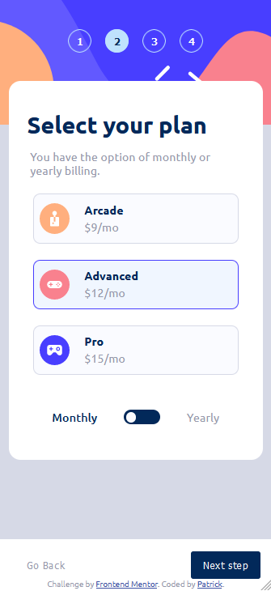

# Frontend Mentor - Multi-step form solution

This is a solution to the [Multi-step form challenge on Frontend Mentor](https://www.frontendmentor.io/challenges/multistep-form-YVAnSdqQBJ). Frontend Mentor challenges help you improve your coding skills by building realistic projects.

## Table of contents

- [Overview](#overview)
  - [The challenge](#the-challenge)
  - [Screenshot](#screenshot)
- [My process](#my-process)
  - [Built with](#built-with)
  - [What I learned](#what-i-learned)
- [Author](#author)

## Overview

4-step form component with summary and final page. Component collects necessary personal data via input windows, lets you choose subscription plan with yearly or monthly billing cycle as well as additional modules.
### The challenge

Users are able to:

- Complete each step of the sequence
- Go back to a previous step to update their selections
- See a summary of their selections on the final step and confirm their order
- View the optimal layout for the interface depending on their device's screen size
- See hover and focus states for all interactive elements on the page
- Receive form validation messages if:
  - A field has been missed
  - The email address is not formatted correctly
  - A step is submitted, but no selection has been made

### Screenshot

### Built with

- Mobile first approach
- Semantic HTML5 markup
- SCSS properties
- Flexbox
- Vanilla JavaScript
- Optimizing code and images with Gulp

### What I learned

I started the challenge with planing how the component should work, look and be coded. To maintain similar look of all the steps I created reusable classes in SCSS definining margin, padding, display properties. Due to lack of experience, some of the functions and classes properties are being repeated - it can be optimized with better planing at the start.

After the challenge, I can predict and plan better what functionalities I will need along the project and create more reusable script functions or CSS classes to optimize the code.

I also starded building the component with 'mobile first' approach and adding responsiveness to wider screens. I created logical code structure for better accessibility and code navigation

Some more specific things I learned:

- Better understanding of display: flex and working with content containers.
- Hover and focus effects for better accesibility.
- Working with checkboxes, labels and their styling to create custom looking input types.
- Media querries for changing the component behavior according to viewport width.
- Better understanding of selecting elements in JS via querySelector method.
- Learned about and used forEach method in JS.

## Author

- Frontend Mentor - [@XHAKEHE](https://www.frontendmentor.io/profile/XHAKEHE)
- GitHub - [@XHAKEHE](https://github.com/XHAKEHE)
